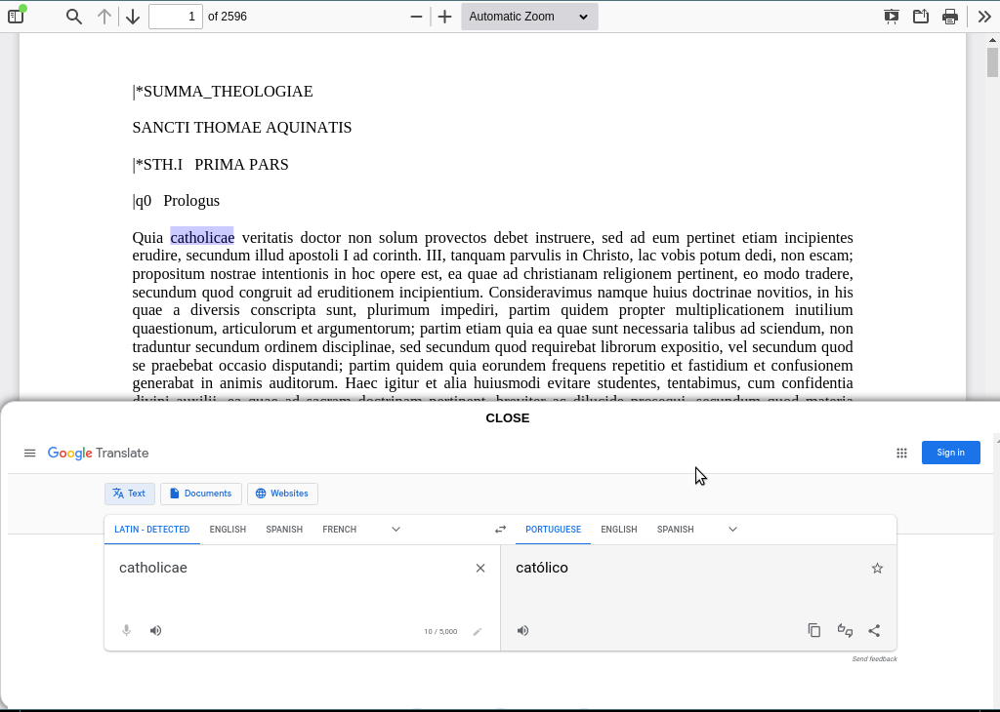

<div align='center'>



</div>

<br>

<p align="center">
    <a href="https://github.com/sponsors/melchisedech333"></a>
    <br><br>
    
    
    
    
    
    
</p>

Language: <a href="readme-pt.md">PT-BR</a>

This is a software made in Javascript and Electron, and its intention is to be a PDF reader with the option to translate parts of the text.

The idea is very simple, I select the text, and when I release the mouse button, it immediately opens a window with the selected text being translated in Google Translate.

To use the application, just download the repository, access it and run <b>electron</b>, passing the directory in question as a parameter.

```bash
electron .
```

The Electron version used in the tests is 19.0.0, and you can download it here: https://github.com/electron/electron/releases/tag/v19.0.0

**If my code has helped you, please consider [sponsoring me](https://github.com/sponsors/melchisedech333) :blue_heart:** 

<br>

:smiley: Author
---

Sponsor: [melchisedech333](https://github.com/sponsors/melchisedech333)<br>
Twitter: [Melchisedech333](https://twitter.com/Melchisedech333)<br>
LinkedIn: [Melchisedech Rex](https://www.linkedin.com/in/melchisedech-rex-724152235/)<br>
Blog: [melchisedech333.github.io](https://melchisedech333.github.io/)<br>


<br>

:scroll: License
---

[ BSD-3-Clause license](./license)

<br><br>

<div align="center">

## Remember to give me <br> a beautiful little star :star_struck:

</div>


